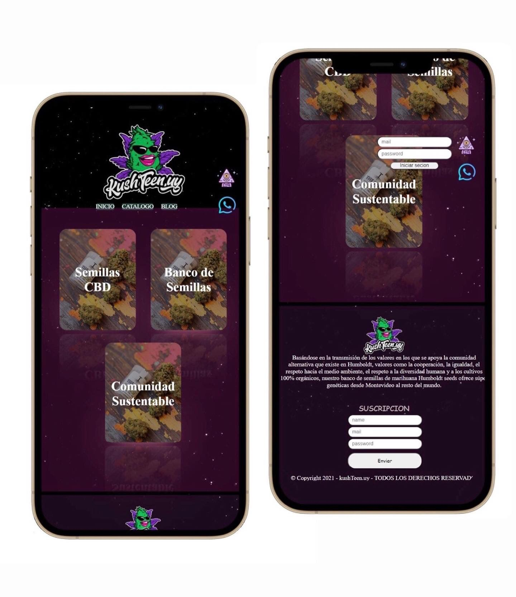
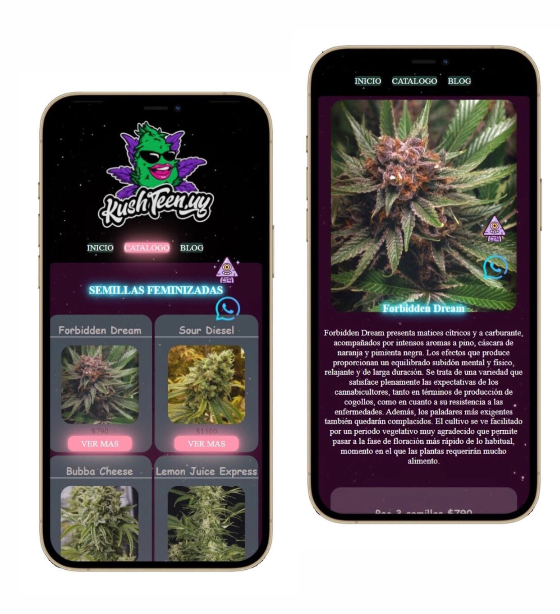
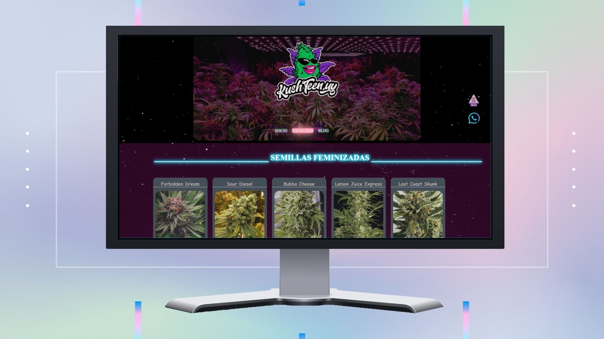
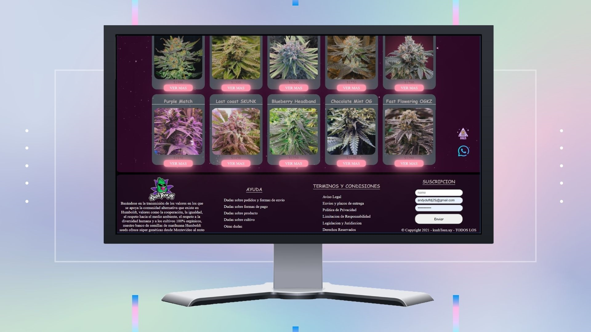

<div align="center">

# 🛍️ KushTeenUy · E-commerce Frontend

[](https://kushteenuy.netlify.app/)


Frontend e-commerce app enfocada en **catálogo de productos**, **contenido de blog/noticias**, **suscripciones** y experiencia responsive mobile-first.

### 🚀 Demo en producción
## **[🔗 Ver sitio desplegado](https://kushteenuy.netlify.app/)**

</div>

---

## ✨ Funcionalidades principales

- 🛒 Catálogo de productos con UI responsive.
- 📱 Diseño mobile-first optimizado para desktop.
- 📰 Sección de noticias/blog.
- 📩 Suscripción de usuarios.
- 🤖 Integración con chatbot.
- 🔌 Consumo de API REST.

---

## 🧰 Tech Stack (visual)

### Frontend


### Integraciones / servicios


### Backend (repositorio separado)


---

## 📸 Screenshots

### Vista móvil
<p align="left">
  
  
</p>

### Vista web
<p align="left">
  
  
</p>

---

## ⚙️ CI/CD

Este proyecto incluye pipeline de **Integración Continua y Despliegue Continuo** con GitHub Actions.

**Workflow principal:** `.github/workflows/ci-cd.yml`

### ¿Cuándo corre?
- Push a rama `main`
- Pull Request hacia `main`

### Etapas automatizadas
1. Instalación de dependencias (`npm install`)
2. Linting (`npm run lint`)
3. Build de producción (`npm run build`)
4. Deploy automático (GitHub Pages)

---

## 🧩 Backend relacionado

API y base de datos en repositorio separado:

- 🔗 https://github.com/AndyV01/-Server-and-Database

---

## 🧪 Desarrollo local

```bash
npm install
npm start
```

Build de producción:

```bash
npm run build
```

---

## 📌 Estado del proyecto

> 🚧 **Legacy project en mejora continua**

Actualmente se mantiene para:

- Practicar CI/CD real en proyectos frontend.
- Mejorar calidad de código.
- Adoptar mejores prácticas modernas.

---

## 👤 Autor

**Andrés Vallarino**  
Frontend / Full-Stack Developer (React-focused)

- GitHub: https://github.com/AndyV01
- Portfolio: https://andyv01.github.io/portafolio/
- LinkedIn: https://linkedin.com/in/andres-vallarino
