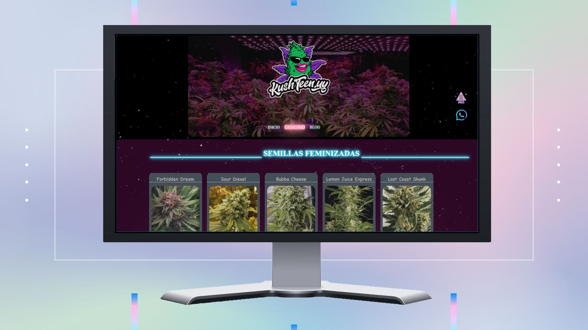

# E-commerce con Blog de noticias, Suscripciones e inicio de secion.

## Available Scripts

In the project directory, you can run:

### `npm run start`

Home vista movil :

 
 

Runs the app in the development mode.\
Open [http://localhost:3000](http://localhost:3000) to view it in the browser.

 

Catalogo vista web:

  

Prototipo 100% responsive a caualquier vista 

servidor Node con Express en : https://github.com/AndyV01/-Server-and-Database

Todo el Frontend con style en css echo especificamente para el proyecto.
